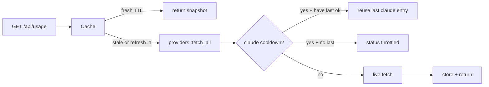

# Step 5 — Agent-box deploy

## Locked defaults

- **systemd**: user unit (`systemctl --user`), `WorkingDirectory` = repo checkout, `ExecStart` = `dist/agent-quota --static packages/web/dist --bind 0.0.0.0 --port 6767`. Runs as the logged-in user so `~/.codex`, `~/.claude`, etc. resolve. No `/opt` install copy.
- **Cache**: in-memory TTL for all providers (default **60s**, `USAGE_CACHE_TTL_MS`) + Claude cooldown (default **20m**, `CLAUDE_FETCH_COOLDOWN_MS`, matching JS). `?refresh=1` bypasses TTL only; Claude cooldown still applies.
- **Auth**: none (VPN-only, already decided). Bind `0.0.0.0` so other VPN hosts can hit the port.



## 1. Server cache layer

Add [`packages/server/src/cache.rs`](packages/server/src/cache.rs):

- `UsageCache` behind `Arc<Mutex<...>>` (or `tokio::sync::Mutex`) holding:
  - `entries: Vec<ServiceUsage>` (last full snapshot)
  - `fetched_at: Instant`
  - `last_claude_fetch: Instant` (only advanced on a real Claude network attempt)
  - optional `last_ok_claude: ServiceUsage` for cooldown reuse
- `get_all(refresh: bool) -> Vec<ServiceUsage>`:
  - if `!refresh` and age &lt; TTL → return clone of `entries`
  - else call `providers::fetch_all()`, then for Claude:
    - if within cooldown: replace Claude slot with `last_ok_claude` if present, else `ServiceUsage` with `status: throttled` + hint (`retry in ~Nm`)
    - if cooldown elapsed: keep live result; on `ok`/`error`/`no_credentials` update `last_claude_fetch` / `last_ok_claude` as appropriate (only bump timer when a live Claude strategy actually ran — i.e. not when result was synthesized)
  - store snapshot + `fetched_at`, return it
- `get_one(id, refresh)`: use `get_all` then pick, or fetch one with same Claude rules (prefer routing through shared snapshot so `/api/usage/claude` and `/api/usage` share state)
- **Singleflight**: while a refresh is in flight, concurrent callers await the same future (simple `Option<Shared<...>>` or “refreshing” flag + notify) so UI + Noctalia don’t stampede providers

Wire in [`packages/server/src/main.rs`](packages/server/src/main.rs):

- Put `UsageCache` on `AppState`
- Parse `?refresh=1` / `?refresh=true` on both usage routes (axum `Query`)
- Replace direct `providers::fetch_all()` / `fetch_one()` with cache methods

Claude cooldown logic lives in cache (or a thin wrapper in `providers/claude.rs` that checks a shared clock). Prefer **cache owns policy** so `providers::fetch_*` stay pure live fetchers.

Env knobs (document in help / PLAN):

| Env | Default | Role |
|-----|---------|------|
| `USAGE_CACHE_TTL_MS` | `60000` | shared snapshot TTL |
| `CLAUDE_FETCH_COOLDOWN_MS` | `1200000` | Claude live-fetch cooldown |
| `USAGE_HTTP_TIMEOUT_MS` | `8000` | already exists |

## 2. systemd user unit

Add [`deploy/agent-quota.service`](deploy/agent-quota.service):

```ini
[Unit]
Description=Agent Quota usage dashboard
After=network-online.target

[Service]
Type=simple
WorkingDirectory=%h/git/other/agent-quota
ExecStart=%h/git/other/agent-quota/dist/agent-quota --static packages/web/dist --bind 0.0.0.0 --port 6767
Restart=on-failure
RestartSec=5
# Optional: EnvironmentFile=%h/git/other/agent-quota/.env

[Install]
WantedBy=default.target
```

Notes in unit comments / short [`deploy/README.md`](deploy/README.md):

1. `pnpm build` in the repo
2. Adjust `WorkingDirectory` / `ExecStart` if checkout path differs
3. `mkdir -p ~/.config/systemd/user && cp deploy/agent-quota.service ~/.config/systemd/user/`
4. `systemctl --user daemon-reload && systemctl --user enable --now agent-quota`
5. `loginctl enable-linger $USER` if it should survive logout
6. Reachability: from another VPN host `curl http://<agent-box>:6767/health` and `/api/usage`

Do **not** auto-install the unit on this machine as part of the PR unless you ask; ship the template + docs.

## 3. PLAN.md

Expand step 5 with the locked cache/systemd details above; mark progress `[x]` when implemented. Note `?refresh=1` is now live (was deferred from step 3).

## 4. Verify

- `pnpm build`
- Hit `/api/usage` twice within TTL → second response should be fast / same snapshot (no duplicate provider skip logs if we only log on live fetch)
- `?refresh=1` forces refetch (except Claude under cooldown → `throttled` or last-ok)
- Unknown `/api/usage/foo` still 404
- Manual: start binary with `--bind 0.0.0.0`, confirm `/health` from localhost (VPN check is ops, not CI)

## Out of scope

- System-wide `/opt` packaging, reverse proxy, TLS, auth
- Persistent disk cache
- Changing UI poll interval (stays 5m; server TTL protects between polls)
