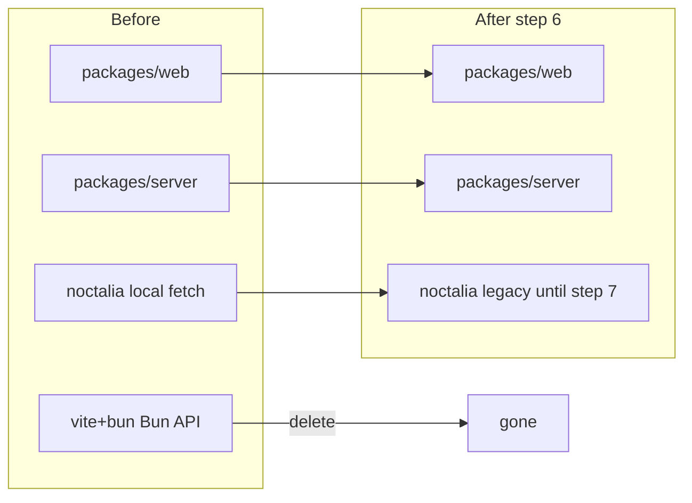

# Step 6 — Retire old trees / docs

## Locked defaults

- **Delete** [`vite+bun/`](vite+bun/) entirely (Bun API + duplicated `credentials.ts` / `usage.ts` + old Solid UI). Source of truth is already [`packages/web`](packages/web) + [`packages/server`](packages/server).
- **Keep** [`noctalia/`](noctalia/) as-is for step 7 (still local-creds QML; no `usage-fetcher.mjs` in tree — fetch logic is inlined in `Main.qml`). Docs will mark it legacy until the dumb-HTTP rewrite.
- **Electron** is already gone from the working tree; docs still mention it — strip those references.
- Do **not** change runtime/deploy behavior (`pnpm build` / systemd / cache).

## 1. Delete obsolete tree

Remove the whole directory:

- [`vite+bun/`](vite+bun/) — `api.ts`, `src/lib/usage.ts`, `src/lib/credentials.ts`, old `App.tsx` (still has Electron IPC), etc.

Also drop ephemeral / junk that should not ship:

- [`step-5-agent-box-deploy.md`](step-5-agent-box-deploy.md) (step is done; details live in [`PLAN.md`](PLAN.md) + [`deploy/README.md`](deploy/README.md))
- Root [`nohup.out`](nohup.out) and [`noctalia/nohup.out`](noctalia/nohup.out) if present (add `nohup.out` / `*.out` to [`.gitignore`](.gitignore) if useful)

Confirm nothing in [`package.json`](package.json), [`pnpm-workspace.yaml`](pnpm-workspace.yaml), or [`scripts/`](scripts/) still references `vite+bun` (current workspace is `packages/*` only — should be clean).

## 2. Rewrite agent docs

Replace [`CLAUDE.md`](CLAUDE.md) / [`AGENTS.md`](AGENTS.md) (symlink) to match reality:

- Overview: one Rust server (`packages/server`) + Solid UI (`packages/web`); Noctalia deferred (legacy local fetch until step 7).
- Dev: `pnpm install`, `pnpm dev` / `pnpm build` / `pnpm start` (point at [`scripts/`](scripts/) and root scripts).
- Architecture: axum routes, `providers/`, `cache.rs`, static from `packages/web/dist`.
- Credentials: resolved only on the agent box by the Rust server (env + `~/.codex`, `~/.claude`, cursor auth paths, OpenCode Go env).
- “Adding a service”: edit Rust `providers/` + `types.rs` + web `V1_SERVICES` / UI filters — no Bun/Electron/Noctalia mirrors.
- Drop all Electron and `vite+bun` command blocks.

## 3. Rewrite root README

Replace [`README.md`](README.md) with a short accurate blurb:

- What it is (v1: Codex, Claude, Cursor, OpenCode)
- Quick start: `pnpm install && pnpm build && pnpm start` (or link [`deploy/README.md`](deploy/README.md) for systemd)
- Link screenshots if still useful; drop “vite app” / Bun framing
- Note Noctalia: present but not yet the dumb VPN client (step 7)

## 4. Mark PLAN progress

In [`PLAN.md`](PLAN.md) step 6: expand with the above bullets and check `[x]` in Progress.

## 5. Verify

- `pnpm build` succeeds (stop/restart `dist/agent-quota` first if `ETXTBSY`)
- `rg 'vite\+bun|electron/'` in docs/scripts is empty (ignore lockfile transitive `electron-to-chromium`)
- `/health` still ok after restart if we bounce the binary

## Out of scope (step 7+)

- Rewriting Noctalia to poll `/api/usage`
- Porting Zai / OpenRouter / Zen
- Auth, TLS, packaging beyond the existing user unit
